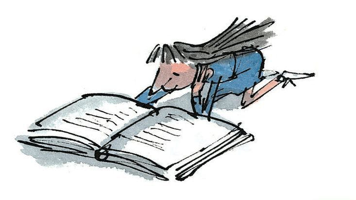

# The Matilda
A reading list inspired by [Roald Dahl](https://www.goodreads.com/author/show/4273.Roald_Dahl)'s [Matilda](https://www.goodreads.com/book/show/39988.Matilda)

---

---

1. [The Secret Garden](https://www.goodreads.com/book/show/2998.The_Secret_Garden) by [Frances Hodgson Burnett](https://www.goodreads.com/author/show/2041.Frances_Hodgson_Burnett)
1. [Great Expectations](https://www.goodreads.com/book/show/2623.Great_Expectations) by [Charles Dickens](https://www.goodreads.com/author/show/239579.Charles_Dickens)
1. [Nicholas Nickleby](https://www.goodreads.com/book/show/325085.Nicholas_Nickleby) by [Charles Dickens](https://www.goodreads.com/author/show/239579.Charles_Dickens)
1. [Oliver Twist](https://www.goodreads.com/book/show/18254.Oliver_Twist) by [Charles Dickens](https://www.goodreads.com/author/show/239579.Charles_Dickens)
1. [Jane Eyre](https://www.goodreads.com/book/show/10210.Jane_Eyre) by [Charlotte Brontë](https://www.goodreads.com/author/show/1036615.Charlotte_Bront_)
1. [Pride and Prejudice](https://www.goodreads.com/book/show/1885.Pride_and_Prejudice) by [Jane Austen](https://www.goodreads.com/author/show/1265.Jane_Austen)
1. [Tess of the d'Urbervilles](https://www.goodreads.com/book/show/32261.Tess_of_the_D_Urbervilles) by [Thomas Hardy](https://www.goodreads.com/author/show/15905.Thomas_Hardy)
1. [Gone to Earth](https://www.goodreads.com/book/show/1505329.Gone_to_Earth) by [Mary Webb](https://www.goodreads.com/author/show/5515884.Mary_Webb)
1. [Kim](https://www.goodreads.com/book/show/210834.Kim) by [Rudyard Kipling](https://www.goodreads.com/author/show/6989.Rudyard_Kipling)
1. [The Invisible Man](https://www.goodreads.com/book/show/17184.The_Invisible_Man) by [H. G. Wells](https://www.goodreads.com/author/show/880695.H_G_Wells)
1. [The Old Man and the Sea](https://www.goodreads.com/book/show/2165.The_Old_Man_and_the_Sea) by [Ernest Hemingway](https://www.goodreads.com/author/show/1455.Ernest_Hemingway)
1. [The Sound and the Fury](https://www.goodreads.com/book/show/10975.The_Sound_and_the_Fury) by [William Faulkner](https://www.goodreads.com/author/show/3535.William_Faulkner)
1. [The Grapes of Wrath](https://www.goodreads.com/book/show/18114322-the-grapes-of-wrath) by [John Steinbeck](https://www.goodreads.com/author/show/585.John_Steinbeck)
1. [The Good Companions](https://www.goodreads.com/book/show/625233.The_Good_Companions) by [J. B. Priestley](https://www.goodreads.com/author/show/87149.J_B_Priestley)
1. [Brighton Rock](https://www.goodreads.com/book/show/48862.Brighton_Rock) by [Graham Greene](https://www.goodreads.com/author/show/2533.Graham_Greene)
1. [Animal Farm](https://www.goodreads.com/book/show/7613.Animal_Farm) by [George Orwell](https://www.goodreads.com/author/show/3706.George_Orwell)
1. [Moby Dick](https://www.goodreads.com/book/show/153747.Moby_Dick_or_The_Whale) by [Herman Melville](https://www.goodreads.com/author/show/1624.Herman_Melville)
1. [Ivanhoe](https://www.goodreads.com/book/show/6440.Ivanhoe) by [Walter Scott](https://www.goodreads.com/author/show/4345.Walter_Scott)
1. [The Red Pony](https://www.goodreads.com/book/show/8732.The_Red_Pony) by [John Steinbeck](https://www.goodreads.com/author/show/585.John_Steinbeck)
1. [Peter and Wendy](https://www.goodreads.com/book/show/36639777-peter-and-wendy) by [J.M. Barrie](https://www.goodreads.com/author/show/5255014.J_M_Barrie)

---

Source of list: https://en.wikipedia.org/wiki/Matilda_Wormwood#Books as of 2018/05/30

Source of image: https://stylist-assets.imgix.net/app/uploads/2017/10/25094816/4572af9aee1dca67c56bcc306ae642b5.jpg as of 2018/05/30
